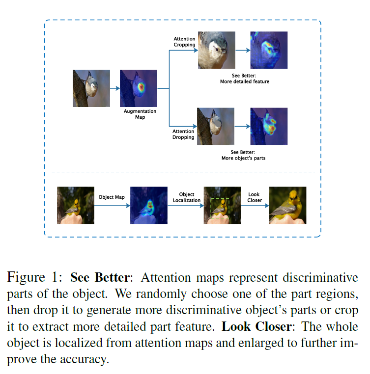
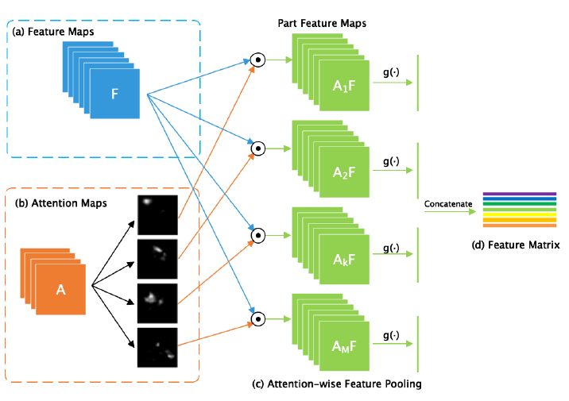
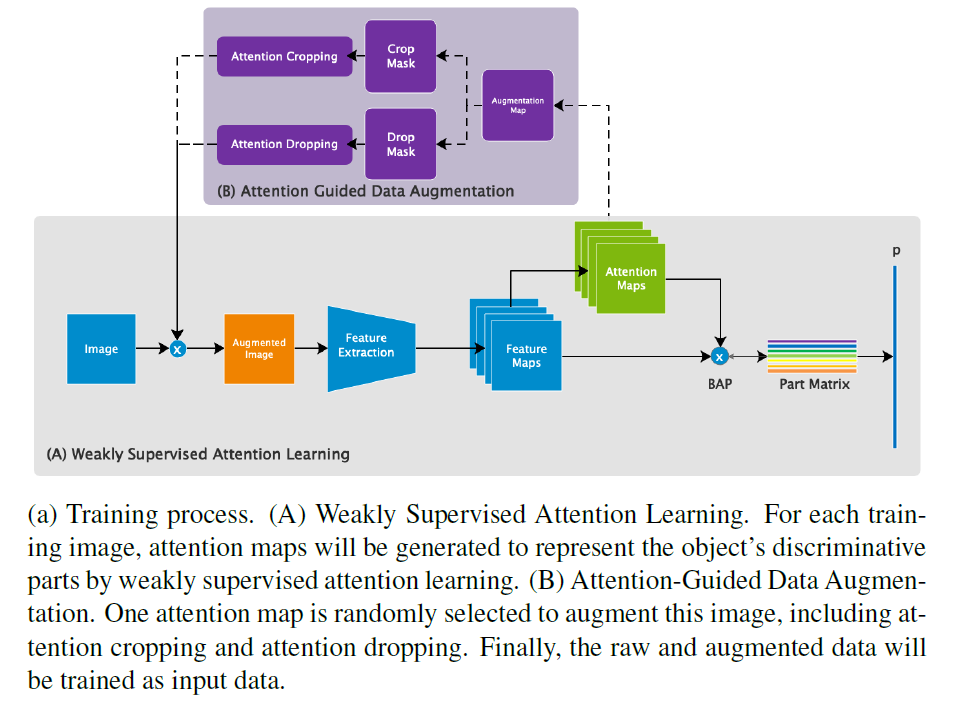
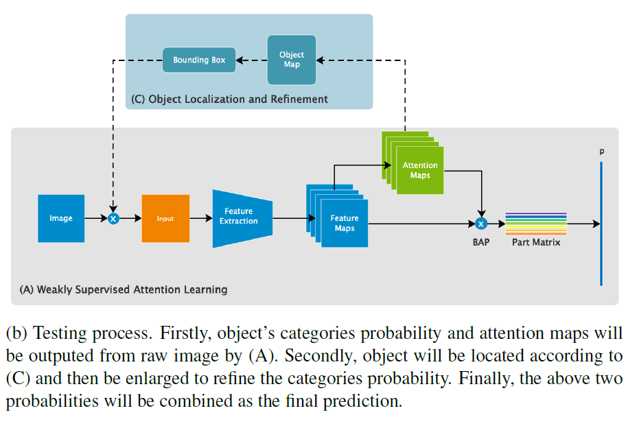
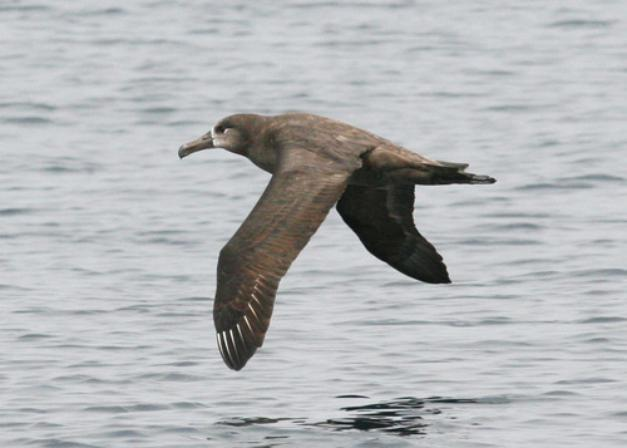
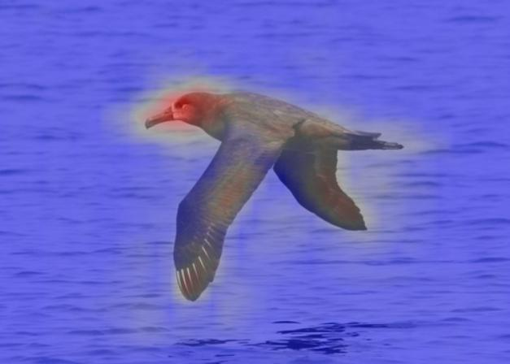
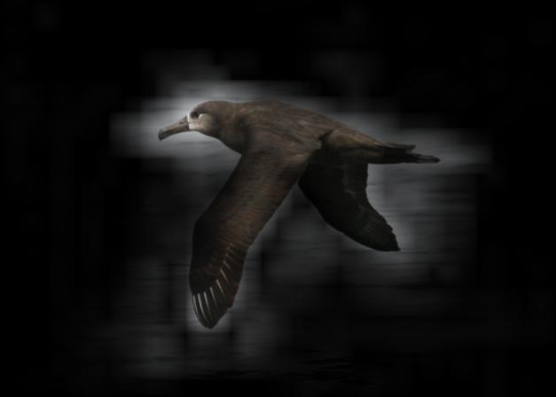

# WS-DAN.PyTorch
A neat PyTorch implementation of WS-DAN (Weakly Supervised Data Augmentation Network) for FGVC (Fine-Grained Visual Classification). (_Hu et al._, ["See Better Before Looking Closer: Weakly Supervised Data Augmentation
Network for Fine-Grained Visual Classification"](https://arxiv.org/abs/1901.09891v2), arXiv:1901.09891)

**NOTICE: This is NOT an official implementation by authors of WS-DAN. The official implementation is available at [tau-yihouxiang/WS_DAN](https://github.com/tau-yihouxiang/WS_DAN) (and there's another unofficial PyTorch version [wvinzh/WS_DAN_PyTorch](https://github.com/wvinzh/WS_DAN_PyTorch)).** 


## Innovations
1. Data Augmentation: Attention Cropping and Attention Dropping
    <div align="left">
    
    </div>

2. Bilinear Attention Pooling (BAP) for Features Generation
    <div align="left">
    
    </div>

3. Training Process and Testing Process 
    <div align="left">
    
    
    </div>


## Performance
* PyTorch experiments were done on a Titan Xp GPU (batch_size = 12).

|Dataset|Object|Category|Train|Test|Accuracy (Paper)|Accuracy (PyTorch)|Feature Net|
|-------|------|--------|-----|----|----------------|--------------------|---|
|[FGVC-Aircraft](http://www.robots.ox.ac.uk/~vgg/data/fgvc-aircraft/)|Aircraft|100|6,667|3,333|93.0|93.28|inception_mixed_6e|
|[CUB-200-2011](http://www.vision.caltech.edu/visipedia/CUB-200-2011.html)|Bird|200|5,994|5,794|89.4|88.28|inception_mixed_6e|
|[Stanford Cars](https://ai.stanford.edu/~jkrause/cars/car_dataset.html)|Car|196|8,144|8,041|94.5|94.38|inception_mixed_6e|
|[Stanford Dogs](http://vision.stanford.edu/aditya86/ImageNetDogs/)|Dog|120|12,000|8,580|92.2|89.66|inception_mixed_7c|


## Usage

### WS-DAN
This repo contains WS-DAN with feature extractors including VGG19(```'vgg19', 'vgg19_bn'```), 
ResNet34/50/101/152(```'resnet34', 'resnet50', 'resnet101', 'resnet152'```), 
and Inception_v3(```'inception_mixed_6e', 'inception_mixed_7c'```) in PyTorch form, see ```./models/wsdan.py```. 

```python
net = WSDAN(num_classes=num_classes, M=num_attentions, net='inception_mixed_6e', pretrained=True)
net = WSDAN(num_classes=num_classes, M=num_attentions, net='inception_mixed_7c', pretrained=True)
net = WSDAN(num_classes=num_classes, M=num_attentions, net='vgg19_bn', pretrained=True)
net = WSDAN(num_classes=num_classes, M=num_attentions, net='resnet50', pretrained=True)
```

### Dataset Directory

* [FGVC-Aircraft](http://www.robots.ox.ac.uk/~vgg/data/fgvc-aircraft/) (Aircraft)

  ```
  -/FGVC-Aircraft/data/
                  └─── images
                          └─── 0034309.jpg
                          └─── 0034958.jpg
                          └─── ...
                  └─── variants.txt
                  └─── images_variant_trainval.txt
                  └─── images_variant_test.txt
  ```

* [CUB-200-2011](http://www.vision.caltech.edu/visipedia/CUB-200-2011.html) (Bird)

  ```
  -/CUB-200-2011
          └─── images.txt
          └─── image_class_labels.txt
          └─── train_test_split.txt
          └─── images
                  └─── 001.Black_footed_Albatross
                          └─── Black_Footed_Albatross_0001_796111.jpg
                          └─── ...
                  └─── 002.Laysan_Albatross
                  └─── ...
  ```

* [Stanford Cars](https://ai.stanford.edu/~jkrause/cars/car_dataset.html) (Car)

  ```
  -/StanfordCars
        └─── cars_test
                  └─── 00001.jpg
                  └─── 00002.jpg
                  └─── ...
        └─── cars_train
                  └─── 00001.jpg
                  └─── 00002.jpg
                  └─── ...
        └─── devkit
                  └─── cars_train_annos.mat
        └─── cars_test_annos_withlabels.mat
  ```

* [Stanford Dogs](http://vision.stanford.edu/aditya86/ImageNetDogs/) (Dog)

  ```
  -/StanfordDogs
        └─── Images
            └─── n02085620-Chihuahua
                    └─── n02085620_10074.jpg
                    └─── ...
            └─── n02085782-Japanese_spaniel
                    └─── ...
        └─── train_list.mat
        └─── test_list.mat
  ```


### Run

1. ``` git clone``` this repo.

2. Prepare data and **modify DATAPATH** in ```datasets/<abcd>_dataset.py```.

3. **Set configurations** in ```config.py``` (Training Config, Model Config, Dataset/Path Config):
    
    ```python
    tag = 'aircraft'  # 'aircraft', 'bird', 'car', or 'dog'
    ```
    
4. ```$ nohup python3 train.py > progress.bar &``` for training.

5. ```$ tail -f progress.bar``` to see training process (tqdm package is required. Other logs are written in ```<config.save_dir>/train.log```).

6. Set configurations in ```config.py``` (Eval Config) and run ```$ python3 eval.py``` for evaluation and visualization.

### Attention Maps Visualization

Code in ```eval.py``` helps generate attention maps. (Image, Heat Attention Map, Image x Attention Map)

<div align="center">



</div>


